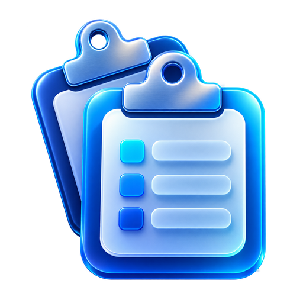
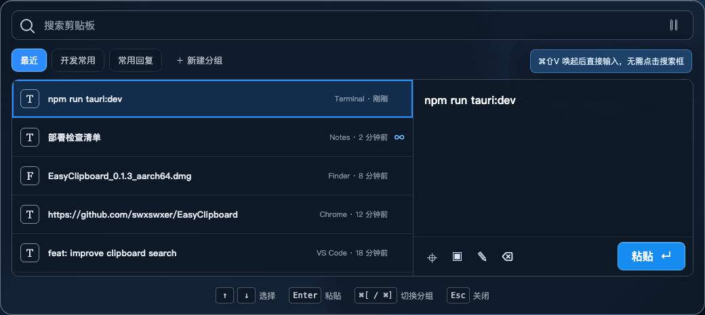

<p align="center">
  
</p>

<h1 align="center">EasyClipboard</h1>

<p align="center">
  一款快速、轻量、本地优先的 Windows 与 macOS 剪贴板历史工具。
</p>

<p align="center">
  复制内容，按下快捷键，搜索并立即粘贴。
</p>

<p align="center">
  <a href="https://github.com/swxswxer/EasyClipboard/releases/latest"></a>
  <a href="https://github.com/swxswxer/EasyClipboard/blob/main/LICENSE"></a>
  
  
  
</p>

---

EasyClipboard 会在本机记录你复制过的文本、图片和文件，让它们可以被快速搜索、整理并再次粘贴。所有历史数据默认只保存在当前设备，不需要账号，也不依赖云服务。

<p align="center">
  
</p>

## 开箱即用，不需要学习

EasyClipboard 刻意保持简单。完成安装与系统授权后，不需要配置工作区、看板、模板或自动化规则：

1. 按 `⌘ ⇧ V` 或 `Ctrl + Shift + V` 打开。
2. 直接输入关键词，搜索框已经自动聚焦。
3. 使用 `↑` / `↓` 选择，按 `Return` / `Enter` 粘贴。

需要长期保留的内容再放进分组；其余内容继续留在“最近”。整个产品只有这一套操作逻辑。

## 与 Raycast、Maccy、PasteBar 有什么不同

EasyClipboard 处在极简历史工具与复杂剪贴板工作台之间：比 Maccy 更适合整理，比 PasteBar 更轻量、简单，比 Raycast 更专注。

| | EasyClipboard | Raycast | Maccy | PasteBar |
| --- | --- | --- | --- | --- |
| 产品定位 | 专用、简单、可分组的剪贴板 | 综合效率启动器中的剪贴板功能 | 极简 macOS 剪贴板 | 功能完整的剪贴板工作台 |
| 平台 | macOS、Windows | macOS、Windows | macOS | macOS、Windows |
| 上手方式 | 打开、输入、回车即可粘贴 | 需要进入 Raycast 命令体系 | 简单、键盘优先 | 需要理解 Collections、Tabs、Boards、Clips 等概念 |
| 内容整理 | 最近、固定、一级分组 | 固定、过滤、Snippet | 主要使用固定 | 多层次集合、标签页、看板、模板和表单 |
| 功能边界 | 只保留高频剪贴板流程 | 包含搜索、扩展、AI、窗口管理等完整生态 | 专注历史搜索 | 包含备份、模板、代码识别、保护集合等大量高级能力 |
| 开源许可 | MIT | 主应用非开源 | MIT | 源码可见，许可证包含非商业限制 |

### 为什么比 PasteBar 更简单

[PasteBar](https://github.com/PasteBar/PasteBarApp) 功能很强，适合希望把剪贴板变成资料库或内容工作台的重度用户；但 Collections、Tabs、Boards、模板、表单和大量特殊操作也意味着更高的理解与配置成本。对于只是想“找到刚才复制的内容并马上粘贴”的用户，这套体系可能显得过重。

EasyClipboard 选择了相反的方向：

- 只有“最近”和一级分组，没有多层工作区结构。
- 打开后立即进入搜索，不需要先选择功能或命令。
- 方向键选择、回车粘贴，鼠标和键盘遵循同一套逻辑。
- 分组内容自动永久保留，不需要额外设置保存规则。
- 没有模板、表单、AI、账号或云同步，界面不会随着功能增加而变复杂。

这不是功能缺失，而是明确的产品取舍：**EasyClipboard 希望成为无需阅读教程、安装后就会用的剪贴板工具。**

### 与 Raycast 和 Maccy 的取舍

- [Raycast](https://manual.raycast.com/clipboard-history) 的剪贴板能力更丰富，并与启动器、扩展和 AI 深度结合；EasyClipboard 适合只想安装一个专用剪贴板、不需要整套效率工具生态的用户。
- [Maccy](https://github.com/p0deje/Maccy) 原生、成熟且非常简洁，但只支持 macOS，主要通过搜索和固定管理内容；EasyClipboard 进一步提供 Windows 支持、可见预览和永久分组。

如果你需要复杂的资料库和模板系统，PasteBar 更合适；如果你只想按下快捷键、输入、回车，然后继续工作，EasyClipboard 更直接。

## 为什么选择 EasyClipboard

- **快速唤起**：使用全局快捷键在当前屏幕底部打开面板。
- **搜索优先**：打开后焦点自动进入搜索框，直接输入即可查找。
- **内容分组**：将常用文本、代码片段和文件放入自定义分组。
- **永久保留**：分组和固定内容不会被普通历史清理删除。
- **智能去重**：相同内容不会重复堆积，重新复制或粘贴后会移动到顶部。
- **本地优先**：SQLite、全文索引、图片和设置全部保存在本机。
- **原生体验**：统一的深色毛玻璃界面，支持托盘/菜单栏和多显示器。

## 核心功能

### 剪贴板历史

- 文本、HTML、RTF。
- PNG、JPEG、TIFF、DIB/DIBV5 图片。
- 单个图片文件自动识别并生成缩略图。
- 有序的多文件路径列表。
- 来源应用、复制时间、内容大小和类型信息。
- 基于 SHA-256 的内容去重与自身写回抑制。

### 搜索与整理

- SQLite FTS5 全文搜索。
- 搜索文本正文、标题、文件名和来源应用。
- 创建、重命名和删除一级分组。
- 将记录移入或移出分组。
- 修改记录的显示标题，不改变原始剪贴板内容。
- 固定重要内容。
- 删除分组时自动将内容移回“最近”。

### 快速粘贴

- 上下方向键选择记录。
- Return/Enter 直接粘贴。
- 上一组/下一组快捷键循环切换分组。
- 自动切回原应用并发送系统粘贴按键。
- 面板失焦、按 Esc 或粘贴完成后自动隐藏。
- 再次按全局快捷键可切换面板显示状态。

### 数据管理

- 可配置最多保留 100、500、1,000 或 5,000 条普通历史。
- 可配置保留 7、30、90 天或不限时间。
- 固定内容和分组内容不参与自动清理。
- 支持暂停记录、清空普通历史和删除全部本地数据。
- 支持登录时启动。

## 快速开始

### 下载安装

前往 [GitHub Releases](https://github.com/swxswxer/EasyClipboard/releases/latest) 下载对应平台的安装包：

| 平台 | 支持范围 | 安装包 |
| --- | --- | --- |
| macOS | macOS 13+，Apple Silicon | `.dmg` |
| Windows | Windows 10/11，x64 | `-setup.exe` |

> 当前安装包尚未进行 Developer ID、Notarization 或 Windows 代码签名。macOS 可能需要在 Finder 中右键选择“打开”，Windows 可能显示 SmartScreen 提示。

### 默认快捷键

| 操作 | macOS | Windows |
| --- | --- | --- |
| 打开/隐藏剪贴板 | `⌘ ⇧ V` | `Ctrl + Shift + V` |
| 上一个分组 | `⌘ [` | `Ctrl + [` |
| 下一个分组 | `⌘ ]` | `Ctrl + ]` |
| 选择上一条/下一条 | `↑` / `↓` | `↑` / `↓` |
| 粘贴选中内容 | `Return` | `Enter` |
| 关闭面板 | `Esc` | `Esc` |

全局唤起、上一组和下一组快捷键都可以在设置中修改。

## 平台说明

### macOS

- 菜单栏常驻，不显示 Dock 图标。
- 需要 macOS 辅助功能权限，用于切回目标应用并发送 `⌘V`。
- 支持应用排除列表，默认忽略常见密码管理器。
- 支持在全屏应用所在 Space 显示面板。
- 使用 `NSPasteboard` 读取和写入剪贴板。

### Windows

- 系统托盘常驻，不显示任务栏窗口。
- 启动后即可记录，不需要辅助功能权限。
- 使用 `AddClipboardFormatListener` 接收剪贴板变化。
- 使用 Win32 `SendInput` 发送 `Ctrl+V`。
- 当目标应用以更高权限运行或系统拒绝焦点切换时，会保留已写入的剪贴板内容并提示手动粘贴。
- Windows 版本不提供应用排除列表，但会遵守系统剪贴板的敏感和禁止历史标记。

## 隐私设计

EasyClipboard 是本地优先应用：

- 不需要注册或登录。
- 不包含云同步。
- 不发送剪贴板内容到网络。
- 不集成统计、广告或行为追踪 SDK。
- 日志不会记录剪贴板正文或文件名。
- 数据保存在操作系统分配给 `com.easyclipboard.desktop` 的应用数据目录。
- 带有 concealed、transient 或系统敏感标记的内容会被忽略。

图片原图、缩略图和 SQLite 数据库都保存在本机。使用“删除全部本地数据”可以移除历史、分组、固定内容、设置和关联 Blob。

## 技术栈

- [Tauri 2](https://tauri.app/)：桌面窗口、托盘、安装包和 IPC。
- [Rust](https://www.rust-lang.org/)：剪贴板、数据库、平台能力和后台任务。
- [React 19](https://react.dev/) + TypeScript：主面板和设置界面。
- [SQLite](https://www.sqlite.org/) + FTS5：本地历史、分组、设置和全文搜索。
- AppKit / `NSPasteboard`：macOS 原生剪贴板与桌面集成。
- Win32 Clipboard API / `SendInput`：Windows 原生剪贴板与自动粘贴。

更完整的模块说明请查看 [EasyClipboard 项目结构说明](EasyClipboard项目结构说明.md)。

## 本地开发

### 环境要求

- Node.js 22+
- npm
- Rust 1.85+
- macOS：Xcode Command Line Tools
- Windows：Microsoft C++ Build Tools 与 WebView2

### 安装依赖

```bash
git clone https://github.com/swxswxer/EasyClipboard.git
cd EasyClipboard
npm ci
```

### 启动开发环境

```bash
npm run tauri:dev
```

### 运行检查

```bash
npm run typecheck
npm test
npm run build:client

cd src-tauri
cargo test --all-targets
cargo clippy --all-targets --all-features -- -D warnings
```

### 构建安装包

```bash
# macOS：生成 .app 与 .dmg
npm run tauri:build -- --bundles dmg

# Windows：生成 NSIS 安装程序
npm run tauri:build -- --bundles nsis
```

产物目录：

- macOS：`src-tauri/target/release/bundle/dmg/`
- Windows：`src-tauri/target/release/bundle/nsis/`

## 项目架构

```text
React 页面
  ↓ ClipboardRepository
Tauri invoke / event
  ↓
Rust Commands
  ├── SQLite / FTS5 / Blob 存储
  ├── 窗口和运行时状态
  └── 平台统一接口
       ├── macOS：NSPasteboard + Accessibility
       └── Windows：Win32 Clipboard + SendInput
```

主要目录：

```text
src/                         React/TypeScript 页面与仓库接口
src-tauri/src/domain/        跨平台剪贴板业务规则
src-tauri/src/platform/      macOS 与 Windows 原生实现
src-tauri/src/database.rs    SQLite、FTS5 与 Schema 迁移
src-tauri/tauri.*.conf.json  公共及平台构建配置
```

## 路线图

- [x] macOS Apple Silicon MVP
- [x] Windows x64 MVP
- [x] 文本、图片和多文件历史
- [x] 搜索、固定、自定义标题和分组
- [x] 本地去重、自动清理和永久保留
- [ ] Intel Mac 与 Windows ARM64
- [ ] 安装包签名与 macOS 公证
- [ ] 自动更新
- [ ] 更多语言

账号、云同步、OCR 和嵌套分组目前不在 MVP 范围内。

## 参与贡献

欢迎提交 Issue 和 Pull Request：

1. 在 [Issues](https://github.com/swxswxer/EasyClipboard/issues) 中描述问题或功能建议。
2. Fork 仓库并从 `main` 创建功能分支。
3. 保持公共业务层与平台原生层的职责边界。
4. 为行为变化补充测试。
5. 确保 TypeScript、Vitest、Cargo Test 和 Clippy 全部通过。
6. 提交 Pull Request 并说明影响的平台及验证方式。

涉及平台原生行为时，请尽量同时说明 macOS 和 Windows 的差异。

## 许可证

EasyClipboard 使用 [MIT License](LICENSE) 开源。你可以自由使用、修改、复制和分发本项目，但需要保留版权和许可证声明。

---

<p align="center">
  如果 EasyClipboard 对你有帮助，欢迎点一个 ⭐。
</p>
